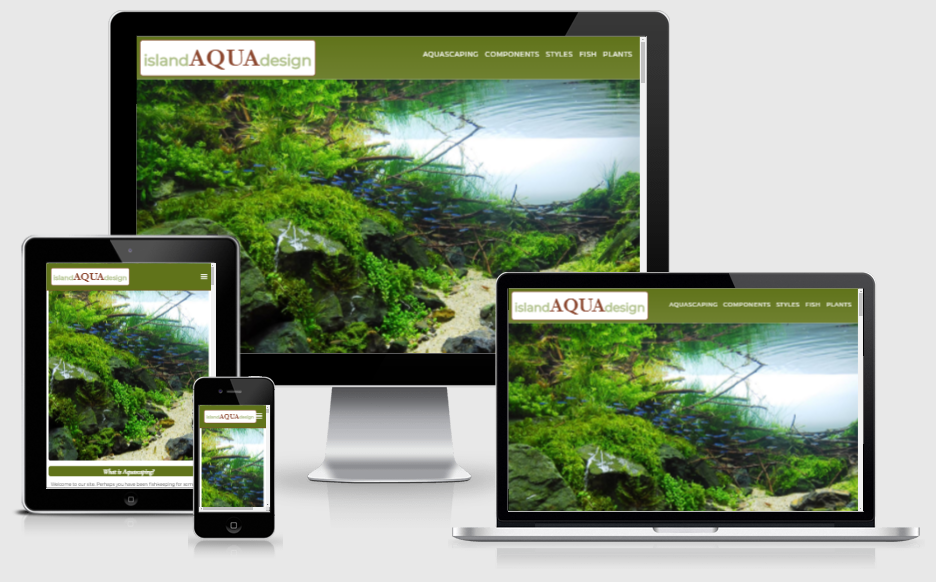
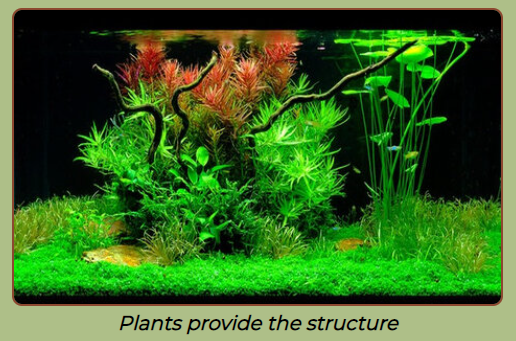
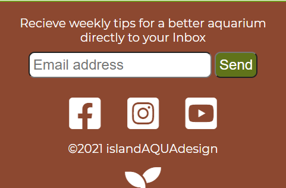
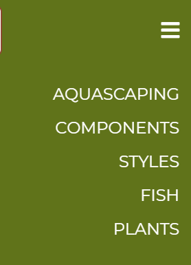

# **islandAQUAdesign**

Welcome to **islandAQUAdesign**. A website developed to introduce amateur aquarists to the popular sub-genre of aquascaping.

 


# UX Design

As a topic aquascaping is too expansive to contain within one small site given project time constraints and the developers recognition of their current skill level.

A conscious decision was taken to generalise content and not be too technical as this could dissuade the aspiring hobbyist.

Using UX principles, *user stories* narrowed the *scope* of the site directing it to provide:
- A broad overview of the aquascaping hobby.
- The core materials used.
- An overview of popular style arrangements.  
- Suitable flora and fauna for a beginner.
- Embedded links that provide launching points to explore other sites to the hobby in more detail.

## Wireframing
- To follow best practice, wireframes were developed for mobile / tablet and desktop based on the webinar of the project lead Matt Boden at the [Code Institute](https://www.codeinstitute.net/). Using his advice the mobile site was developed before the desktop.
- Wireframes were created using [Balsamiq Cloud](https://balsamiq.cloud/sqiyfsu/pr12ogh/r2278#). I went a little further almost to mockup level to help visualise the development needed.  Having the *skeleton* in place focused subsequent coding. (Note I consider it fair to admit I abandoned a previous iteration of the project as it lacked direction and was proving to be frustrating. This was a good early learning experience which deserves mentioning). UX defines proper development practices!

## Color Scheme and Accessibility
- The *color scheme* was devised by taking an image of a home aquarium.
The image was passed to [Adobe Color](https://color.adobe.com/create/image-gradient).
- To meet WCAG 2.0 criteria, the generated colour scheme was then passed to [eightshapes.com](http://www.eightshapes.com) for an [accesibility table](docs/readme/color_scheme.png "Color Accessibilty").

## Code Reusability
- CSS variables were used to improve code reusability.  RGB values were saved into the `:root` level of the external CSS file.  These values were then available when declaring rgbA values.  This is a superior solution as it saves time by changing the code in one place to changes multiple elements simultaneously.  It also provided the option to easily control the *alpha* value if required.
- Classes were reused insofar as possible to promote homogeneity across the site. See below for an example of code utilising css variables.

    ```css
    :root {
        --theme-one: 96, 115, 26;
    }

    h2 {
        background-color: rgba(var(--theme-one),1);
    }
    ```

## CSS Grid used to layout desktop site
At an early stage upon the advice of my mentor, I learned *CSS Grid* in order to develop the [desktop site](docs/readme/desktop_grid_view.png "Image of Grid view enabled using Google Chrome developer Tools section").  Research credited in the content section demonstrates it has  superior responsiveness and is more adaptable for placing future sections than utitising relative/absolute displays and archaic floats.  Consider it a bespoke version of Bootstrap.
I opted to explicity place sections as opposed to declaring grid areas in this instance as the site is small.
Also noted is the importance of *html structure*. Sections that are nested have an affect on the grid behaviour.
Generally *grid* offers more flexibility for moving / adding sections to the site in future and ultimately requires less code. It is more readable therefore is easier to maintain.

# Existing Features

## One Page Site / Future Implementations
Developing a single page site with multiple sections was merely a personal preference. It's considered a *top level* to convey general information.  Future development could include more technical aspects of being an aquarist maintained of separate pages.  For example, the Nitrogen cycle, Co2 injections systems, specialist lighting setups, best products on the market etc.
Another idea was to fix the header to the top of the desktop page. When hovering/focusing on a particular section the relevant link in the menu would appear active. This would provide the user a further indicatiojn of were they were in the web document.

## Header logo & Navigation
On mobile and tablet the header is *fixed* to keep navigation accessible via the hamburger icon.  
This serves as a link to the home of the website in line with intuitive user experience on mobile / tablet resolutions.

- The site has two Navigation bar styles.  A Hamburger style for mobile and tablet screens with limited screen space and a standard navbar as viewed on the desktop landing page in the next section.


## Landing page
- The *landing page* hero background is designed to draw the user into the topic as a picture paints a thousand words.
As a hobby, a good aquascape is aesthetically pleasing therefore conveys an implicit message to the visitor.
- On loading the desktop site, note the subtle use of greyscale fading into the standard contrast to emphasise the beauty of nature.

 

## External Links
- *External links* provide a launching point for the user to explore the hobby in more detail. These are carefully selected and reputable.
- Each link opens in a new tab so the user can easily refer back to main site.

 

## Footer
    - The *footer* offers the user three options:
     - A means to provide an email address to sign-up to a newsletter. Note an extensive form page isn't needed for the website's purposes.
    - Links that open to new social media tabs for yet to be developed supporting content. Social media icons scale up on muse hovewr to improve user experience.

     - A link to the top of the page by clicking the favicon.
     
 


# Testing

## Validator Testing
- HTML code passed through the offical [W3C Markup Validator](https://validator.w3.org/). 1 error remaining.  Intentionally left as section meant for holding background image content only.

    ```html
    <section id="hero-bg" class="hero-bg">
        <!-- no heading required as suggested by validator check.  Section to hold a background image only -->
    </section>
    ```
- CSS code passed through the offical [W3C Jigsaw Validator](https://jigsaw.w3.org/css-validator/) - No errors found.

## Fixed Bugs
- Mobile/Tablet *fixed header* obscures section links leading to a negative user experience.
Utilised [css only solution](https://codepen.io/cferdinandi/pen/GRJvozN) **scroll-margin-top** to scroll 121px above the ection links. Incidentially this is the height of the fixed header + 10px of white background space.

    ```css
    section[id] {
    scroll-margin-top: 111px;    
    }
- Email field validation can be bypassed by directly clicking the submit button or pressing enter. To fix this I added *required* to the end of input tag as below.

    ```html
    <input id="email-field" type="email" name="user-email" placeholder="Email address"
                aria-label="Type your email address here" required>
    ```
    

```

## Unfixed Bugs

    - *Mobile nav menu* does not collapse after selecting link then focusing on other parts of page. The menu icon must be clicked again to uncheck hidden checkbox
        A review of [Stack Overflow](https://stackoverflow.com/) suggests no known fix using CSS only and that JS is required.
        
        


# Deployment

The site was deployed to *GitHub* pages. The steps to deploy are as follows:
- In the GitHub repository, navigate to the *Settings* tab
- From the source section drop-down menu, select the Master Branch
- Once the master branch has been selected, the page will be automatically refreshed with a detailed ribbon display to indicate the successful deployment.

The live link can be found here - https://stevenweir038.github.io/islandAQUAdesign/index.html

## Local Deployment

In order to make a local copy of this repository, you can clone the project by typing the follow into your IDE terminal:
- `git clone https://github.com/StevenWeir038/islandAQUAdesign.git`

Alternatively if using gitpod you can click [here](https://gitpod.io/#https://github.com/StevenWeir038/islandAQUAdesign)

# Credits

## Content
- Thankyou you to [Wes Bos](https://www.youtube.com/watch?v=DCZdCKjnBCs) and [Kevin Powell](https://www.youtube.com/watch?v=duH4DLq5yoo) for CSS grid tutorials to develop my understanding of responsive web design.
- Use of CSS variables supported by the [Web Dev Simplified channel on YouTube](https://www.youtube.com/watch?v=oZPR_78wCnY).
- Thankyou you to my mentor [Tim Nelson](https://github.com/TravelTimN) for his advice on html structure, semantics and improved user experience [https://css-tricks.com/snippets/jquery/smooth-scrolling/].


## Media


